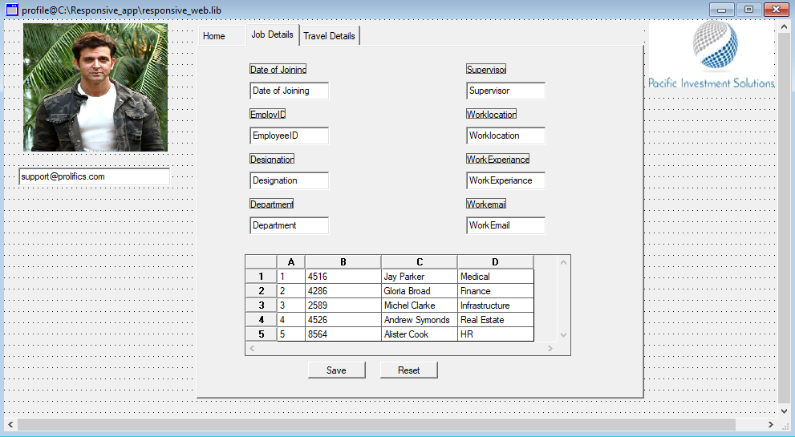
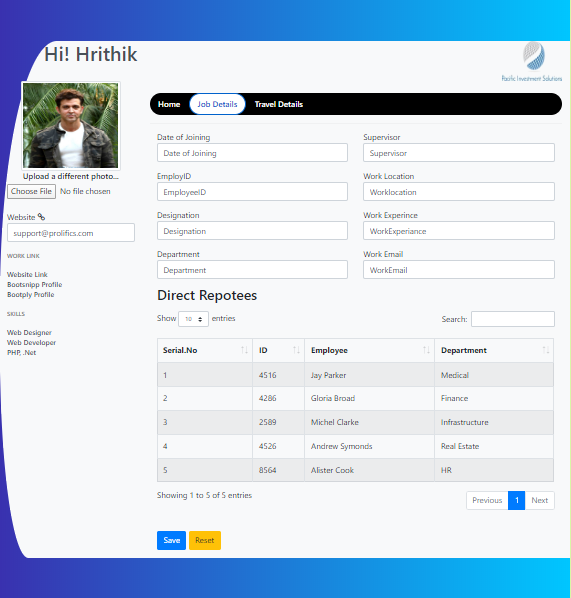

# WidgetsInTheBrowser
A simple HTML Template and Panther screen that demonstrates a smooth migration of Panther widgets in the web browser. Below are screenshots of a Panther client screen and its migrated screen . Latest Bootstrap libraries were used to transform the plain screen into a modern, responsive screen. It includes most of the Panther widgets with Bootstrap Datatable.

Profile client screen

Profile web screen

# Prerequisites
Panther Web 5.5*

# This repository consists of 4 files
* Panther screen with name profile
* profile.html
* profile.css
* profile.js

# Profile screen
Panther profile screen containing various Panther widgets like grid, single line text filelds, multiline text filelds, dropdowns, tabs etc.

# Profile.html
HTML template is attached to the Panther profile screen via property WEB OPTION->HTML OPTIONs->HTML Template .

# Profile.css
Cascading Style Sheets(CSS) file contains requirements like classes and ids provided to HTML tags.

# Profile.js
Javascript file contains requirements like generating a Bootstrap Datatable for Panther grid.

Need a Panther Web 552 Redhat Image? [Click Here](https://hub.docker.com/r/prolificspanther/pantherweb "Named link title") 

How to set up a Panther Servlet Web Application? [Click Here](https://github.com/ProlificsPanther/PantherWeb/releases "Named link title")

Read our Documentation [here](https://docs.prolifics.com)
